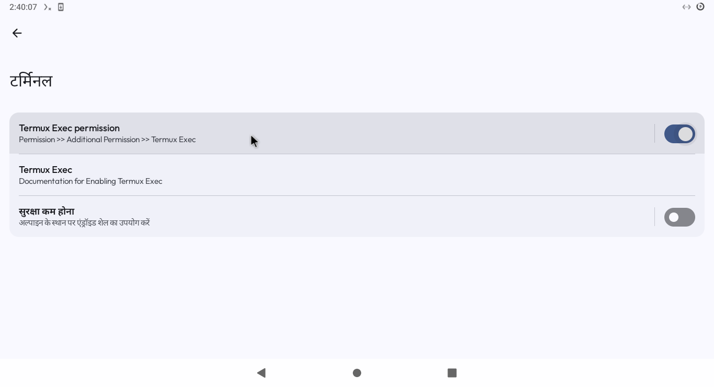
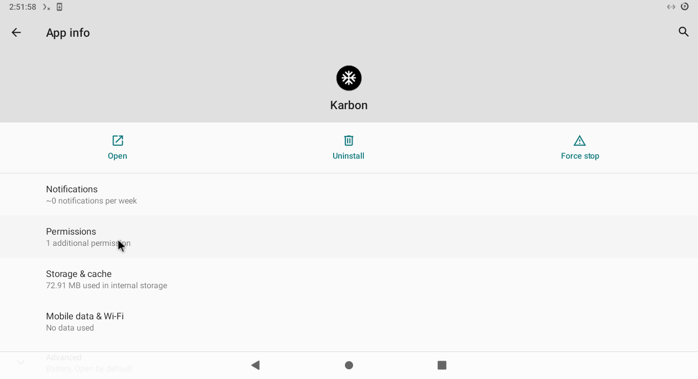
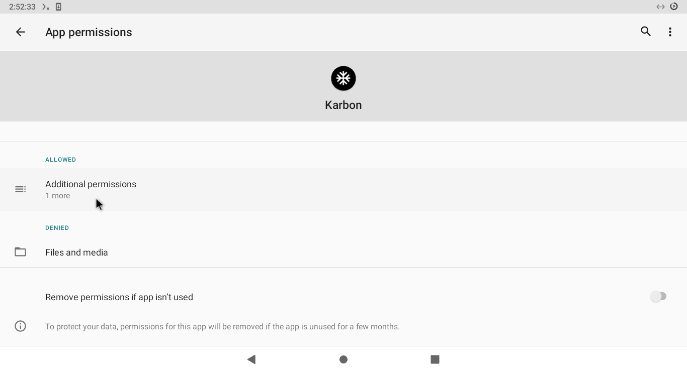
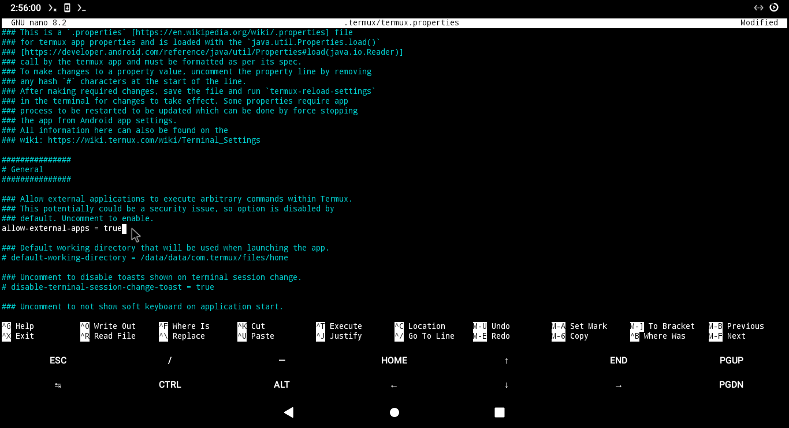

### Setting Up **Xed-Editor** with Termux

To enable **Xed-Editor** to execute commands in the Termux environment, follow these steps carefully:

---

#### Step 1: Grant Execute Permissions to **Xed-Editor**

1. After installing Termux, you must grant **Xed-Editor** the necessary permission to run commands in the Termux environment.  
   To do this:  

   - Follow the instructions in the images below:

   
   
   

---

#### Step 2: Enable External Apps in Termux

1. Open the Termux configuration file by running the following command in Termux:

   ```bash
   nano ~/.termux/termux.properties
   ```

2. Add the following line to the file:

   ```text
   allow-external-apps = true
   ```

3. Save the changes and exit the editor.  
   Here's a visual example of what the configuration should look like:  

   

4. Restart Termux to apply the changes.

---

#### Step 3: Configure Xed-Editor Terminal

1. Open **Xed-Editor** and navigate to:  
   **Settings → Terminal → Terminal Runtime** and select Termux to use termux
   
3. If everything is set up correctly, the **Termux-Exec Switch** should now be active.

---

#### Step 4: Grant "Display Over Other Apps" Permission

Lastly, ensure that **Termux** has the **Display Over Other Apps** permission enabled.  
This is essential for smooth integration with **Xed-Editor**.
